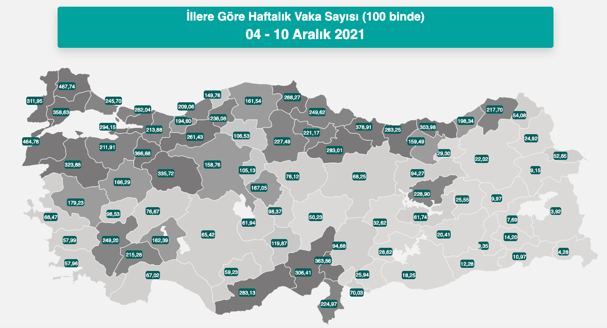

Visit the website https://covid19.saglik.gov.tr/ which gives weekly official statistics on Covid-19 cases in
our country. 

1. The front web page involves an interactive map titled "İllere göre haftalık vaka sayısı (100 binde)", where a static version of it is also given below.

```{r, echo=F, fig.align='center', out.width="60%", fig.cap = "İllere göre haftalık vaka sayısı (100 binde)"}

```

1. Scrape the data right below this interactive map, which is available as a table at https://covid19.saglik.gov.tr/,  
via `R package rvest`.
2. Use this data to reproduce this **map** via `R package leaflet`.  
   2.1. You can use the `shape files` which we have used in lectures.  
   2.2. In the map there seems that there are five different gray colors depending on the confirmed case count value: 1) 0-51, 2) 52-150, 3) 151-200, 4) 201-250, and 5) 250+.  This implies that you have to find 5 different hex colors in gray tone in an ascending form (from light to dark) to associate it count value.
   2.3. In map 1, you do not need to fill text boxes available in each province and pop-window backgrounds in green color. It requires some HTML skills. 
   2.4. You do not have to put the plot titles. It requires some HTML skills.  
   2.5. When merging spatial data files with scraped data according to provinces, be careful. Double-check the name of provinces. If you are doing something wrong you can understand it by checking the locations of the provinces on map.  
   2.6. Save the map as a `.html` file by `htmlwidgets::saveWidget`.   
3. Feel free to improve the readability of the map.
4. Since the websites are being updated regularly, it is not of importance which data you have used in your homework as long as it belongs to a recent one.


**Cautionary notes**: 
1) Homework assignments are individual-based studies. For that reason, students are expected to do homework assignments by themselves (**I will also check your commit history to see the evolution of the homework over time**). Homework assignments will not be accepted after deadline. There is **NO** make-up for missed homework.
2) You should clone `Homework II-R Project` on [GitHub Classroom of MAT381E-Fall21](https://github.com/MAT381E-Fall21) organization into your local computer, do the changes as needed, delete all the files you have not used to produce your homework, and finally commit and push all the required files (including `.Rmd` files) by
January 10, 2022 18:00 via [GitHub Classroom of MAT381E-Fall21](https://github.com/MAT381E-Fall21) organization.
